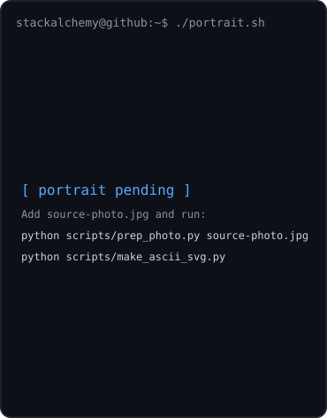
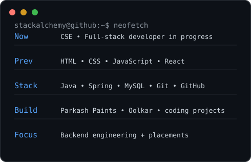

<div align="center">

<h3><code>stackalchemy@github ~ $ ./contributions.sh</code></h3>



<br><br>

<h3><code>stackalchemy@github ~ $ whoami</code></h3>

<table>
  <tr>
    <td valign="top">
      
    </td>
    <td valign="top">
      
    </td>
  </tr>
</table>

<br>

<code>stackalchemy@github ~ $ cat /etc/profile</code>

</div>

---

## About

I’m **Rishabh Madaan**, a CSE engineering student focused on becoming a strong full-stack/backend developer.

I like building real products, learning Java and Spring, and combining engineering with creative design.

### Current focus

```text
Java              █████████████████░░░
Spring Boot       ██████████████░░░░░░
SQL / MySQL       ███████████████░░░░░
React             ██████████████████░░
DSA               ███████████████░░░░░
Git / GitHub      █████████████████░░░
```

### Featured projects

- **Parkash Paints** — product showcase website built with React + Vite
- **Oolkar** — appointment-booking startup project
- **Java backend projects** — REST APIs, Spring, Hibernate and database work

### Connect

[GitHub](https://github.com/stackalchemy) · [Parkash Paints](https://parkash-paints.vercel.app/)

---

### How the profile art works

The visual layer is self-hosted in this repository:

- `avi-ascii.svg` — portrait animation
- `info-card.svg` — terminal/neofetch card
- `contrib-heatmap.svg` — generated contribution calendar
- `scripts/` — Python generators
- `.github/workflows/update-profile-art.yml` — daily refresh

No JavaScript is required in the README. The contribution data is fetched from GitHub’s public contribution-calendar HTML and the resulting SVG is committed back to this repository.

### Personalize the portrait

Put a photo named `source-photo.jpg` in the repository root, then run locally:

```bash
python -m venv .venv

# Windows PowerShell
.venv\\Scripts\\Activate.ps1

# Ubuntu/Linux/macOS
source .venv/bin/activate

pip install -r scripts/requirements.txt
python scripts/prep_photo.py source-photo.jpg
python scripts/make_ascii_svg.py
python scripts/make_info_card.py
```

Commit the generated `avi-ascii.svg` and `info-card.svg`. The source photo and `source-prepped.png` can stay local if you prefer.

The contribution graph updates automatically every day through GitHub Actions. The workflow uses the repository’s `GITHUB_TOKEN` with `contents: write` so it can commit regenerated JSON/SVG files back to the repo.
